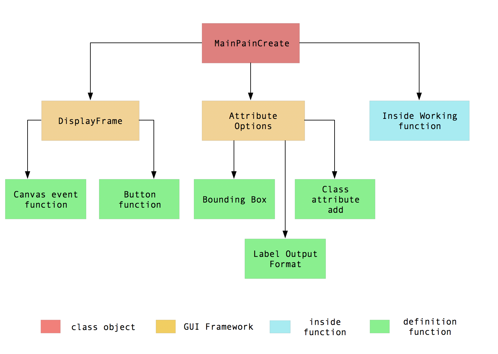
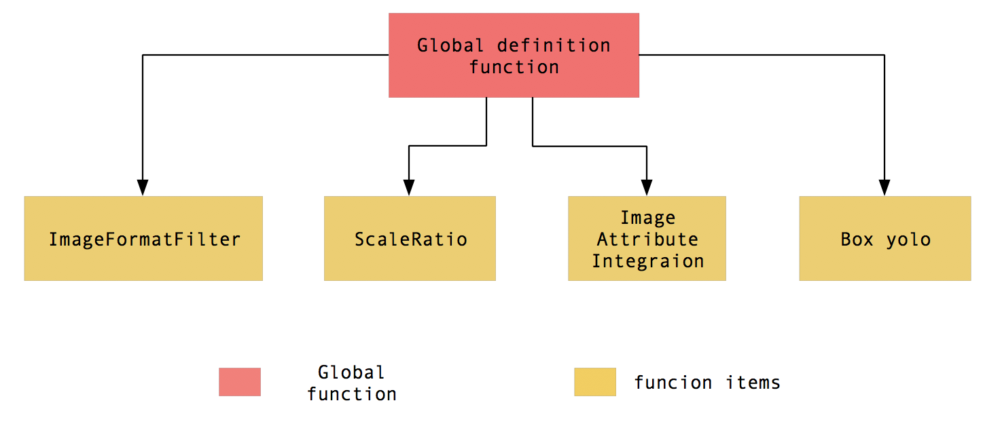

# Label Maker Function
### 1. Class object :
  - MainPanelCreate : 物件名稱(內部總共有27個定義函式)。
    + \__init__ : 初始化所有面板功能。
  - DisplayFrame function : 負責畫布(主要顯示圖片與畫框)與控制圖片前後的按鈕功能。
    1. Canvas event function : 以下為畫布觸發事件(點擊、滑動、取消框選)。
      + mouseClick : 由 tkinter event 構成，負責點擊的觸發狀態紀錄。
      + mouseMove : 由 tkinter event 構成，負責鼠標在畫布上的移動畫框與顯示鼠標目前位置。
      + cancelBBox : 點擊錯誤時取消畫布上的框選位置。
    2. Button command definition : DisplayFrame框架上綁定在按鍵的功能。
      + SelectPath <--> `SelectPath` : 選擇圖片的路徑。
      + LoadImage <--> `Load` : 載入輸入路徑檔案內的第一張圖片。
        * Maintain <--> `Maintain` : 維持目前隱藏屬性資料夾內所有檔案。
        * DeleteDir <--> `DeleteDir` : 刪除目前隱藏屬性資料夾內所以檔案。
      + PreLoad <--> `<< Prev` : 以目前圖片的位置往前一張載入。
      + NextLoad <--> `>> Next` : 以目前圖片的位置往後一張載入。
      + ImageJump <-->  `Jump` : 直接載入至輸入的索引圖片位置。
  - AttributeOptions function : 屬性框架內有四個主要的功能(圖片基本資料顯示、邊界框座標位置顯示刪除、物件屬性名稱顏色增加刪除、label檔案格式選擇與輸出)。
    1. Bounding Box : 邊界框座標位置顯示刪除。
      + removebox <--> `<Del One>` : 移除選取單一邊界框。
      + deleteallbox <--> `<Del All>` : 移除全部邊界框。
    2. Class Attribute Add : 增加物件屬性與名稱。
      + addattribute <--> `Add`: 由 tkinter Toplevel構成產稱子視窗讓使用者可以增加物件的名稱、ID、顏色。
        * createclass <--> `create` : 創造N種物件(N是由使用者挑選)。
        * choosecolor <--> `selectN` : 讓使用者可以選擇物件框顏色。
        * deleteclass <--> `delete` : 刪除所有創建屬性。
        * inserlist <--> `insert` : 添加屬性至屬性列表並顯示。
      + removeattribute <--> `Remove` : 移除列表點選的屬性。
    3. Label Outout Format : label輸出格式。
      + pathinsert : 判斷勾選的格式並匯入自訂的資料夾路徑。
      + gerenatefile : 產生 tkinter Toplevel 詢問使用者使是否產生label格式。
        + GYes <--> `Yes` : 確定輸出。
        + GNo <--> `No` : 取消輸出。
  - Inside working function : 以下為內部的功能構成函式。
    + removeallattribute : 幫助圖片前後載入時清除所有的屬性(為了避免 overloading一直顯示過多相同的屬性)。
    + getbboxcolor : 抓取鼠標點選屬性時所添加的名稱及顏色。
    + saveImagedata : 儲存每張圖片的所有屬性包含基本資訊、物件名稱、物件顏色、物件ID與物件的各個邊界框位置儲存至".attribute"隱藏屬性資料夾。
    + readjson : 讀取隱藏屬性資料夾並顯示出以標記過圖片的各種資訊。
    
### 2. Definition function :
  - ImgFormatFilter : 過濾資料夾，並進一步過濾檔案名稱並非圖片的格式。
  - ScaleRation : 計算縮放比例。
  - IAI(image attribute integration) : 圖片資料整合用於顯示基本的圖像資訊於列表(Image Basic Data)上。
  - Box_yolo : 將輸出的格式轉換成yolo格式。
    
